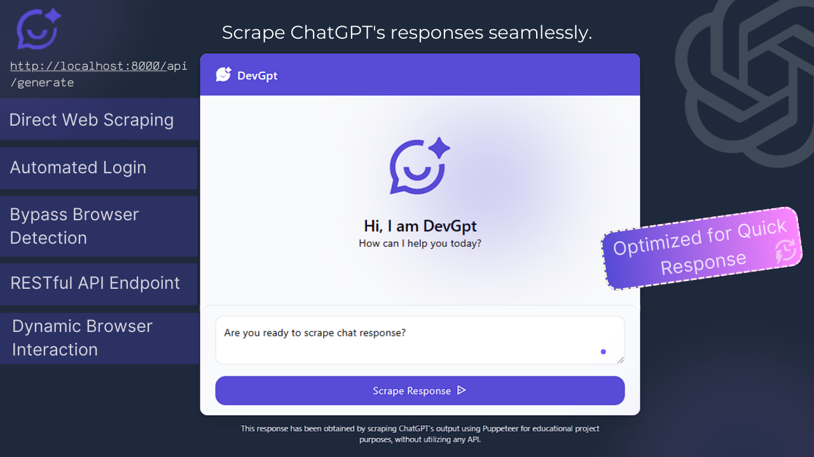

# DevGPT: Innovative ChatGPT Scraping Solution



## 🚀 Project Overview

DevGPT is a unique project that provides an alternative method to interact with ChatGPT by bypassing traditional API limitations. Instead of using official LLM APIs, this project employs web scraping techniques with Puppeteer to fetch responses directly from the ChatGPT web interface.

## ⚠️ Important Disclaimer

**PRACTICE PROJECT NOTICE**
- This is a **experimental/practice project**
- Not intended for production use
- May have significant limitations and potential issues
- Use at your own risk
- Potential instability due to web scraping techniques
- Subject to breaking changes in ChatGPT's website structure

## 🌟 Key Features

- **Direct Web Scraping**: Extracts ChatGPT responses without using official APIs
- **Automated Login**: Seamless Gmail authentication
- **Bypass Scraping Detection**: Advanced techniques to circumvent anti-scraping mechanisms
- **RESTful API Endpoint**: `/api/generate` for easy integration
- **Dynamic Browser Interaction**: Puppeteer-powered response generation

## 🔧 Project Constants

The project uses the following key constants (from `src/utils/constants.ts`):

| Constant | Value | Description |
|----------|-------|-------------|
| `COOKIES_PATH` | `"cookies.json"` | Path for storing authentication cookies |
| `LOGIN_DELAY` | `5000` | Delay (in ms) during login process |
| `GPT_URL` | `"https://chatgpt.com/"` | Target ChatGPT website URL |
| `BROWSER_OPEN` | `true` | Flag to control browser visibility |
| `BROWSER_WITHOUT_RESOURCES` | `false` | Flag to control resource loading |
| `RATE_LIMIT_WINDOW_MS` | `5 * 60 * 1000` | Rate limit window (in ms) |
| `RATE_LIMIT_MAX` | `100` | Maximum requests per window |

## 🛠 Technology Stack

- TypeScript
- Puppeteer
- Express.js
- Gmail Authentication

## 📦 Prerequisites

- Node.js (v14+ recommended)
- npm or yarn
- Gmail account for authentication

## � Authentication and Privacy

### Gmail Login Requirement

- **Why Gmail?** ChatGPT requires authentication before accessing its services
- A Gmail account is necessary to log in and interact with the ChatGPT interface
- **Privacy Assurance**: 
  - Credentials are **ONLY** used locally for authentication
  - No credentials are transmitted, stored, or shared externally
  - Credentials are used solely to establish a browser session

### Credential Handling

1. Store credentials securely in `.env` or `.env.local`
2. Never commit credentials to version control
3. Use environment variables for sensitive information

```bash
# Example .env file
GMAIL_EMAIL=your_email@gmail.com
GMAIL_PASSWORD=your_secure_password
```

**Important**: 
- Recommend using an app-specific password
- Consider two-factor authentication for added security
- Credentials are processed entirely within your local environment

## �🔧 Installation

1. Clone the repository
   ```bash
   git clone https://github.com/yourusername/devgpt.git
   cd devgpt
   ```

2. Install dependencies
   ```bash
   npm install
   ```

3. Set up environment variables
   Create a `.env` file with the following:
   ```
   GMAIL_EMAIL=your_email@gmail.com
   GMAIL_PASSWORD=your_gmail_password
   ```

## 🚀 Running the Project

### Development Mode
```bash
npm run dev
```

### Production Build
```bash
npm run build
npm start
```

## 🔍 API Usage

### Generate Response
- **Endpoint**: `/api/generate`
- **Method**: POST
- **Request Body**:
  ```json
  {
    "prompt": "Your question or prompt here"
  }
  ```

## ⚠️ Legal and Ethical Considerations

This project is for educational purposes. Always respect ChatGPT's terms of service and be aware of potential legal implications of web scraping.

## 🤝 Contributing

1. Fork the repository
2. Create your feature branch (`git checkout -b feature/AmazingFeature`)
3. Commit your changes (`git commit -m 'Add some AmazingFeature'`)
4. Push to the branch (`git push origin feature/AmazingFeature`)
5. Open a Pull Request

## 📄 License

Distributed under the MIT License. See `LICENSE` for more information.

## 🙌 Acknowledgements

- Puppeteer
- ChatGPT
- Open-source community